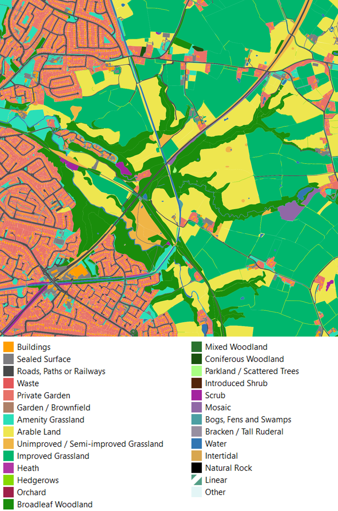

## Welcome
EcoservR is a tool for mapping natural capital assets and ecosystem services. It is a re-write of [Ecoserv-GIS](https://www.nature.scot/snh-research-report-954-ecoserv-gis-v33-toolkit-mapping-ecosystem-services-gb-scale) and is currently being developed and tested at Liverpool John Moores University in collaboration with [Natural Capital Solutions](http://www.naturalcapitalsolutions.co.uk/), [Forest Research](forestresearch.gov.uk/), and the [Cheshire Wildlife Trust](https://www.cheshirewildlifetrust.org.uk/) as part of a [Defra](https://www.gov.uk/government/organisations/department-for-environment-food-rural-affairs) test and trial for the new Environmental Land Management System (ELMS).

### Jump to...

+ [The Ecoserv approach](#the-ecoserv-approach)
+ [Environmental baseline](#environmental-baseline)
+ [Ecosystem services](#ecosystem-services)
+ [Applications](#applications)
+ [EcoservR release](#ecoservr-release)
+ [Get in touch](#get-in-touch)

  

# The Ecoserv approach

EcoservR is an updated version of [Ecoserv-GIS](https://www.nature.scot/snh-research-report-954-ecoserv-gis-v33-toolkit-mapping-ecosystem-services-gb-scale), a toolkit for mapping habitats and ecosystem services in the UK using widely available national datasets. The toolkit generates an environmental baseline classifying over 200 habitat types, and uses spatial models to map their capacity to provide a range of ecosystem services, as well as the demand for them.

We decided to re-write Ecoserv-GIS in the R language to eliminate the dependency on proprietary software and workflows that were no longer supported. [R](https://www.r-project.org/) is a free, open-source software widely used in the environmental sciences and with growing geospatial capacities. EcoservR currently supports 7 of the 9 original Ecoserv-GIS ecosystem services. It is currently restricted to English datasets but we are planning support for the whole of Great Britain. 

  

  

  
# Environmental baseline

 Description of the baseline process......... LOOOOOOONG text very long text Description of the baseline process....... LOOOOOONG text very long text Description of the baseline process..... LOOONG text very long text. As you can see, I added 10px of padding to the right side of the left-aligned image. I also used the float property to move the image out of the normal flow of the document and put it to the left side of the parent container.

  

## Datasets

EcoservR uses nationally available datasets, most of which are free and available under an Open Government licence. Required datasets are indicated in bold, while the rest are optional. Some service models require additional layers. 

+ __OS MasterMap__ (*licence required*)
+ OS Greenspace (*license required*) and/or __Open Greenspace__
+ Natural England __Priority Habitat Inventory__
+ CORINE land cover (recommended)
+ Crop Map of England (recommended)
+ National Forest Inventory
+ Terrain data (DTM) (*required for water service models*)
+ Public Rights of Way (*recommended for accessible nature models*)
+ CRoW Open Access land (*recommended for accessible nature models*)
+ Designated sites (LNR, NNR, national parks, etc.) (*recommended for accessible nature models*)

*Note: These layers are indicated for sites in England. We are planning to incorporate workflows for Scottish and Welsh sites next year.*

## Generating a baseline 
brief description of processing steps

## Habitat classification

When all the desired datasets have been added to the basemap, a rule-based classification step assigns a habitat code to each polygons. Currently, the datasets with the ability to inform this classification are OS MasterMap, OS (Open) Greenspace, Priority Habitat Inventory, CROME, and CORINE. Other rules based on polygon size also inform the classification.

.... Phase 1 code... future compatibility with UK HAB

# Ecosystem services

EcoservR measures and maps a range of ecosystem services. Capacity and demand maps can be analysed to identify opportunities and "pinch points", to plan and deliver interventions where they are best suited and most needed. The current toolkit includes:

+ __Carbon storage__: storage of carbon in above- and below-ground biomass, including the upper 30 cm of soil
+ __Air purification__: removal of pollutants from the air by natural vegetation
+ __Water purification__: interception of pollutants by natural vegetation before they can enter a water course
+ __Pollination__: contribution of some insects to crop yield by carrying pollen across the landscape
+ __Local climate regulation__: mitigation of "heat island" effects by natural features that absorb excess heat or provide shade
+ __Noise regulation__: absorption of traffic noise by vegetation
+ __Accessible nature__: opportunities for people to enjoy natural places around their everyday working and living space. 

We are currently developing models to measure __carbon sequestration__, __biodiversity__, and __flood risk mitigation__.

 
 *Example of capacity score maps for a farm holding in Cheshire*

  

IMAGE: EXAMPLE OF CAPACITY AND DEMAND MAP
  

# Applications

## ELMS Test and Trial
We are using EcoservR to develop an environmental baseline of the Dane river catchment area (Cheshire) and quantify ecosystem services at farm- to landscape- scale to help inform land management plans. 

| I am text to the left. This is an image of carbon storage capacity. Isn't it great?  |  |

  
## Liverpool City Region baseline
some text here

## Cheshire & Warrington baseline
some text here

# EcoservR release

We are working towards a beta-release of the toolkit as a series of R scripts in late August 2020. 

  

# Get in touch

Questions or feedback? Please get in touch with us at ecoservR *at* gmail.com

