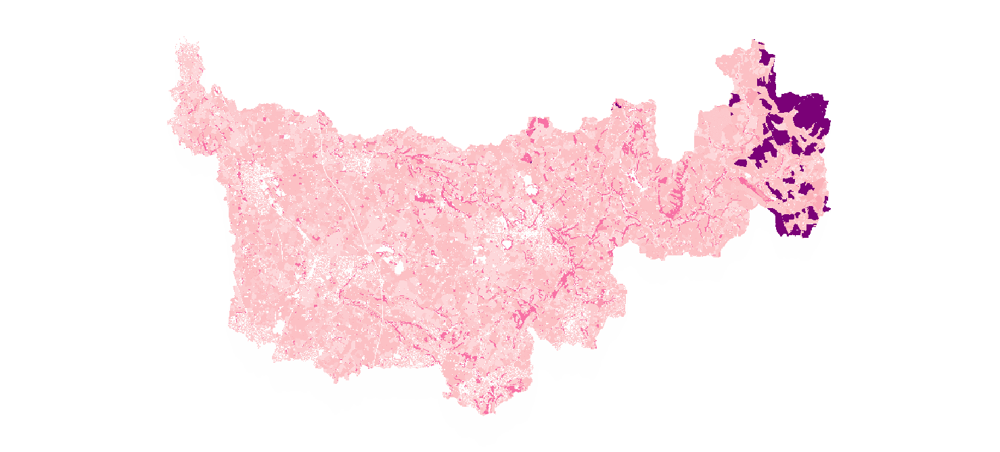

## Welcome
EcoservR is a tool for mapping natural capital assets and ecosystem services. It is a re-write of [Ecoserv-GIS](https://www.nature.scot/snh-research-report-954-ecoserv-gis-v33-toolkit-mapping-ecosystem-services-gb-scale) and is currently being developed and tested at Liverpool John Moores University in collaboration with [Natural Capital Solutions](http://www.naturalcapitalsolutions.co.uk/), [Forest Research](forestresearch.gov.uk/), and the [Cheshire Wildlife Trust](https://www.cheshirewildlifetrust.org.uk/) as part of a [Defra](https://www.gov.uk/government/organisations/department-for-environment-food-rural-affairs) test and trial for the new Environmental Land Management System (ELMS).

### Jump to...

internal links to sections on the page
+ [The Ecoserv approach](#the-ecoserv-approach)
+ [Environmental baseline](#environmental-baseline)
+ [Ecosystem services](#ecosystem-services)
+ [Applications](#applications)
+ [EcoservR release](#ecoservr-release)
+ [Get in touch](#get-in-touch)

  

# The Ecoserv approach

EcoservR is an updated version of [Ecoserv-GIS](https://www.nature.scot/snh-research-report-954-ecoserv-gis-v33-toolkit-mapping-ecosystem-services-gb-scale), a toolkit for mapping habitats and ecosystem services in the UK using widely available national datasets. The toolkit generates an environmental baseline classifying over 200 habitat types, and uses spatial models to map their capacity to provide a range of ecosystem services, as well as the demand for them.

We decided to re-write Ecoserv-GIS in the R language to eliminate the dependency on proprietary software and workflows that were no longer supported. [R](https://www.r-project.org/) is a free, open-source software widely used in the environmental sciences and with growing geospatial capacities. EcoservR currently supports 7 of the 9 original Ecoserv-GIS ecosystem services. It is currently restricted to English datasets but we are planning support for the whole of Great Britain. 

More general stuff.....

  

# Environmental baseline

Description and image

## Datasets

list of datasets used in baseline

## Generating a baseline 
brief description of processing steps

## Habitat classification

When all the desired datasets have been added to the basemap, a rule-based classification step assigns a habitat code to each polygons. Currently, the datasets with the ability to inform this classification are OS MasterMap, OS (Open) Greenspace, Priority Habitat Inventory, CROME, and CORINE. Other rules based on polygon size also inform the classification.

.... Phase 1 code... future compatibility with UK HAB

# Ecosystem services

EcoservR measures and maps a range of ecosystem services. Capacity and demand maps can be analysed to identify opportunities and "pinch points", to plan and deliver interventions where they are best suited and most needed. The current toolkit includes:

+ __Carbon storage__:
+ __Air purification__: 
+ __Water purification__: 
+ __Pollination__: 
+ __Local climate regulation__: 
+ __Noise regulation__: 
+ __Accessible nature experience__: 

We are currently developing models to measure __carbon sequestration__, __biodiversity__, and __flood risk mitigation__.

IMAGE: EXAMPLE OF CAPACITY AND DEMAND MAP

  

  
  
  

# Applications

## ELMS Test and Trial
some text here

## Liverpool City Region baseline
some text here

## Cheshire & Warrington baseline
some text here

# EcoservR release

We are working towards a beta-release of the toolkit as a series of R scripts in late August 2020. 

  

# Get in touch

Questions or feedback? Please get in touch with us at ecoservR *at* gmail.com

