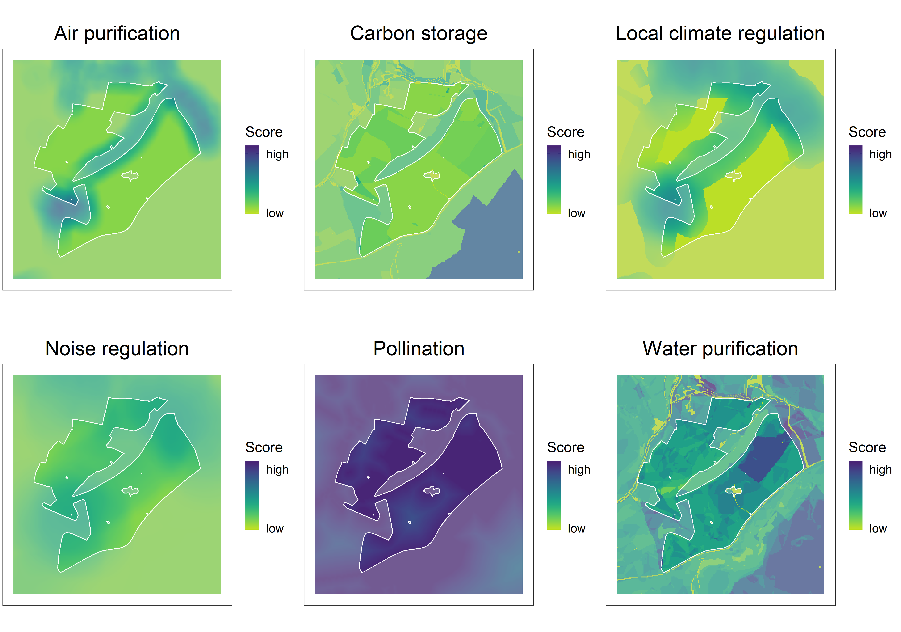

# Ecosystem services

EcoservR measures and maps a range of ecosystem services. Capacity and demand maps can be analysed to identify opportunities and "pinch points", to plan and deliver interventions where they are best suited and most needed. The current toolkit includes:

+ __Carbon storage__: storage of carbon in above- and below-ground biomass, including the upper 30 cm of soil
+ __Air purification__: removal of pollutants from the air by natural vegetation
+ __Water purification__: interception of pollutants by natural vegetation before they can enter a water course
+ __Pollination__: contribution of some insects to crop yield by carrying pollen across the landscape
+ __Local climate regulation__: mitigation of "heat island" effects by natural features that absorb excess heat or provide shade
+ __Noise regulation__: absorption of traffic noise by vegetation
+ __Accessible nature__: opportunities for people to enjoy natural places around their everyday working and living space. 

We are currently developing models to measure __carbon sequestration__, __biodiversity__, and __flood risk mitigation__.

 
 *Example of capacity score maps for a farm holding in Cheshire*

