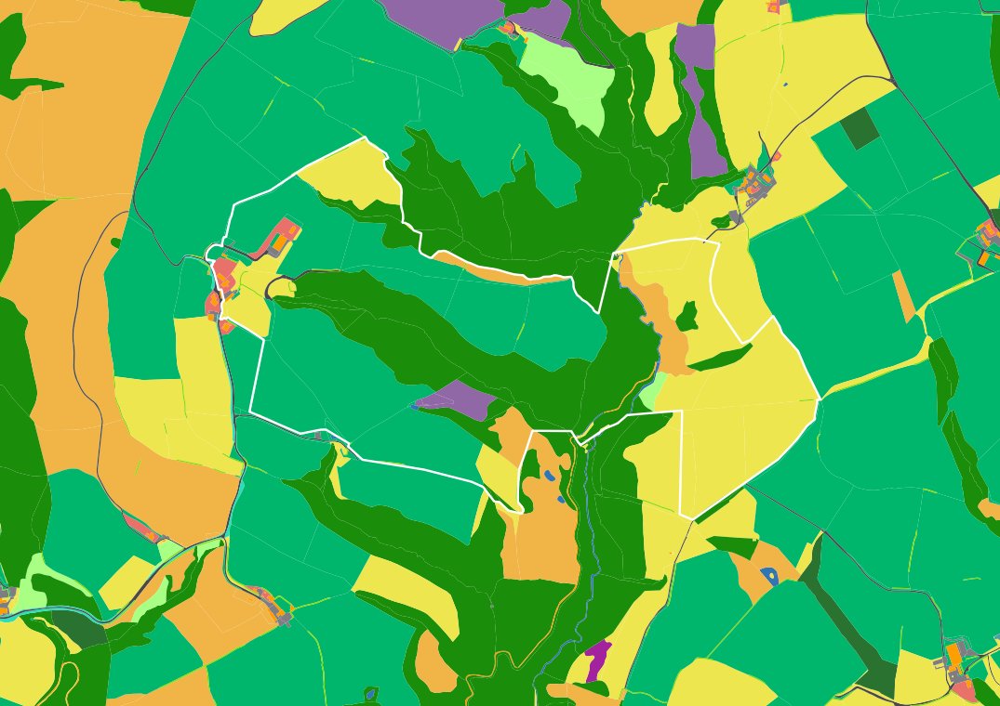
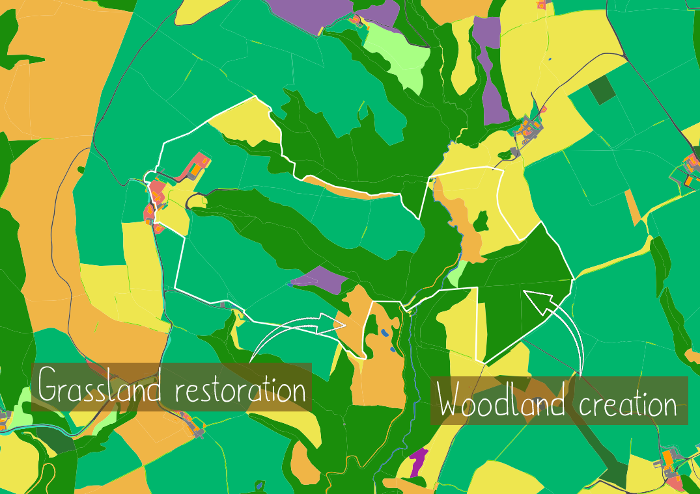

# Measuring change

A powerful application of EcoservR is quantifying environmental gains and losses arising from interventions. By running ecosystem service models on the environmental baseline and on a modified masterplan for a site, you can:
+ identify which interventions result in trade-offs (reduction in a service possibly mitigated by gain in another)
+ identify which interventions provide multiple benefits (increase in multiple services)
+ measure these impacts at site- to regional scale, supporting strategic planning aligned with local priorities

Here we demonstrate a simple workflow for measuring projected change, as could be applied in an environmental net gain context. We take a (fictional) example of agri-environmental interventions carried out on a farm - the same could be done with a new build in an urban area. 

## Designing interventions

Deciding where to build, or where to carry out interventions is dictated by availability and suitability. The <a href="{{ site.github.url }}/basemap">environmental baseline</a> and an initial <a href="{{ site.github.url }}/ecoservices">ecosystem service</a> assessment may help identify opportunities. Once you have mapped out the projected intervention (or a set of competing interventions), this can be merged into the existing baseline to create a "masterplan" map reflecting the land use change.

You can drag the slider to explore the simulated changes in our farm example. Areas of arable land and improved grassland have been converted to a higher quality grassland, and trees were planted to create a native woodland. Additionally, public access was granted for this woodland. In this simple scenario, creating the masterplan is as simple as editing the habitat code for the respective polygons, but more complex interventions can be mapped by using GIS editing tools.  

 

    
    
 

<link rel="stylesheet" href="https://cdn.knightlab.com/libs/juxtapose/latest/css/juxtapose.css">

Habitat map of a fictional farm (white outline) before and after proposed agri-environmental interventions.   Maps contain Ordnance Survey data © Crown copyright and database rights 2020 Ordnance Survey (100025252)

## Comparing scores

Once your baseline and intervention maps are ready, you can run all the relevant <a href="{{ site.github.url }}/ecoservices">service models</a> for your study area. You can compare the results visually and quantitatively, and assess whether your environmental targets are met or need another round of modification.

You can toggle the layers on the maps below to see how the farm (and the wider landscape around it) has benefited from the planned agri-environmental interventions. 



 

Gains in air purification (left) and carbon storage (right) capacity on a fictional farm (white outline) before and after proposed agri-environmental interventions, as modelled by EcoservR. Scores have been rescaled to 0-100 to simplify visualisation.

A table for the results at multiple scales 

|   |   |   |   |   |
|---|---|---|---|---|
|   |   |   |   |   |
|   |   |   |   |   |
|   |   |   |   |   |

## And another section here
with some text again

