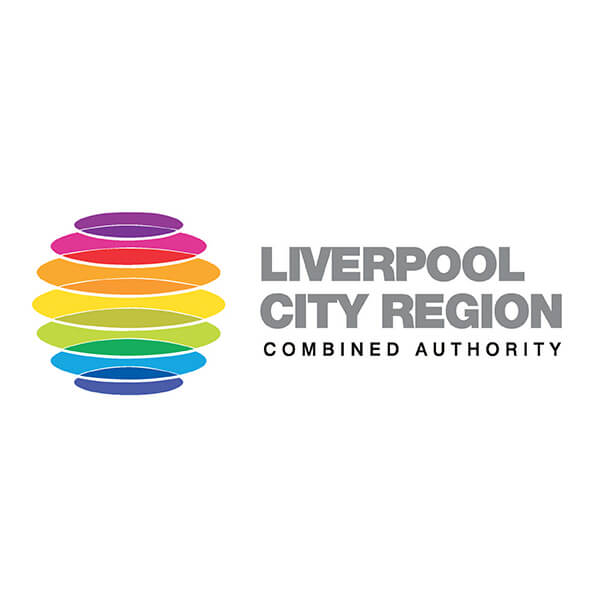
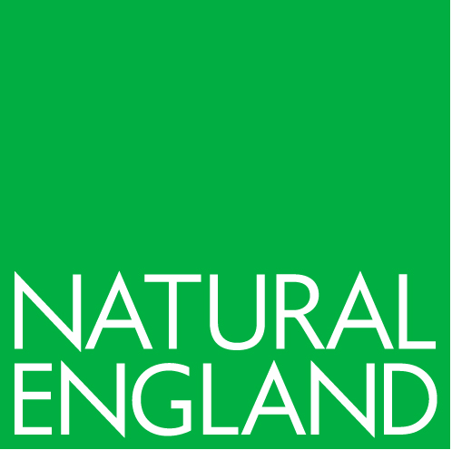
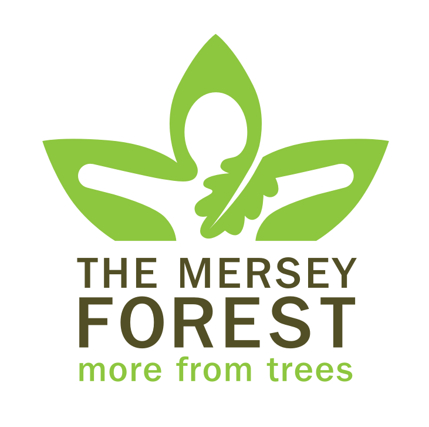
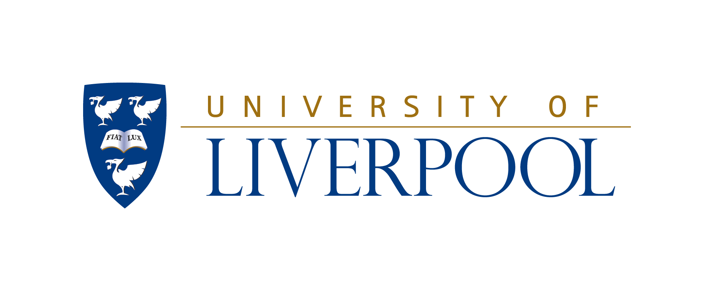
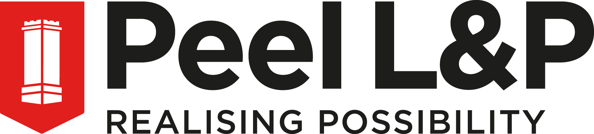
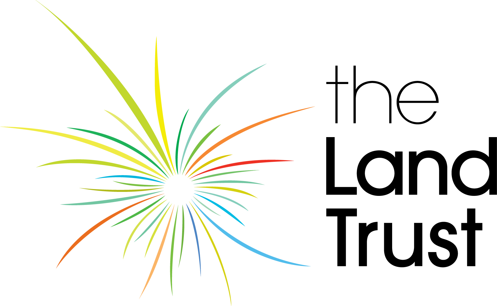
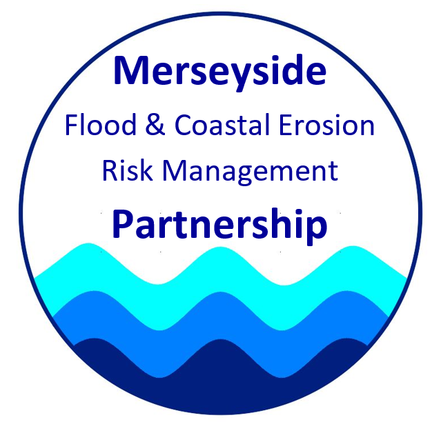
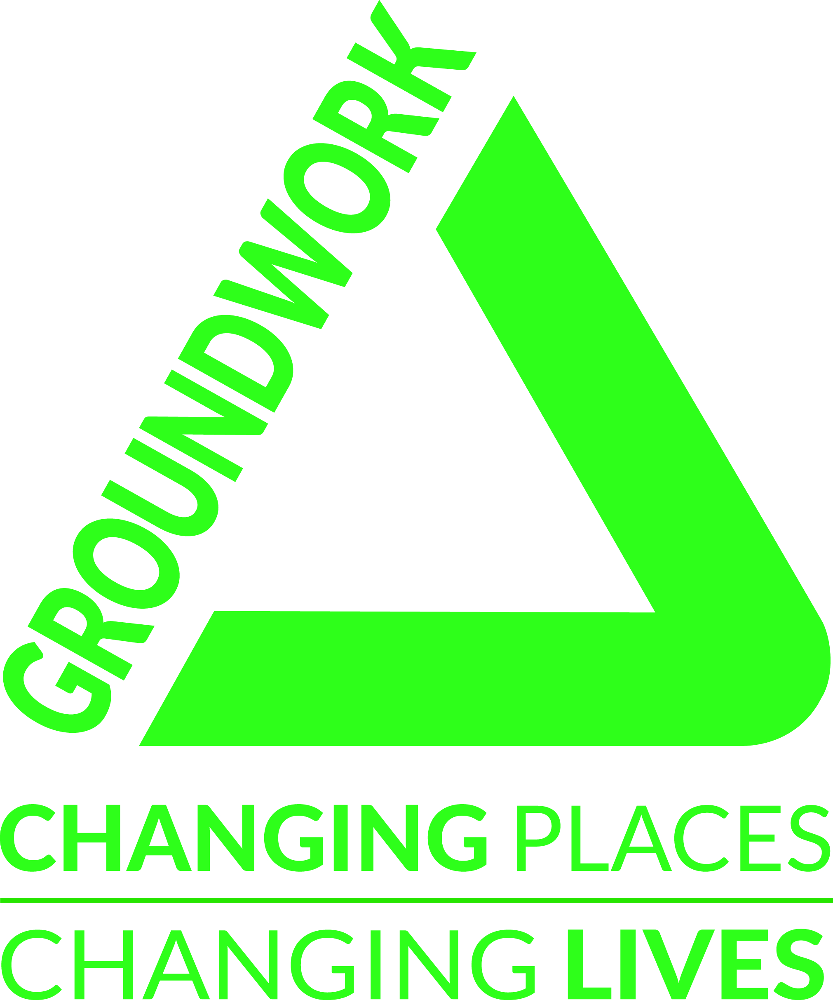
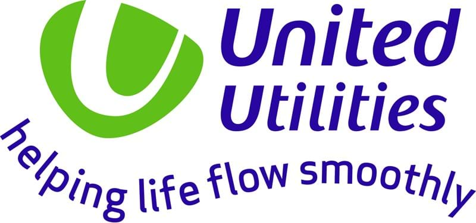

# Partners

## Co-developers

<table style="display: block; margin-left:auto, margin-right:auto;">
  <tr>
    <td>  </td>

    <td></td>
   </tr>
   
   <tr>
    <td>  </td>

    <td></td>
   </tr>
   
</table>

## Supporting partners

These partners are members of the Liverpool City Region Natural Capital Working Group (a sub group of Nature Connected), and have supported the development of the Ecoserv approach.

<table style="display: block; margin-left:auto, margin-right:auto;">
    
  <tr>
    <td>  </td>

    <td></td>
  </tr>
  
   <tr>
    <td>  </td>

    <td></td>
  </tr>
   
  <tr>
    <td>  </td>

    <td></td>
  </tr> 
  
    <tr>
    <td>  </td>

    <td></td>
  </tr> 
  
  <tr>
    <td>  </td>

    <td></td>
  </tr> 
  
  <tr>
    <td>  </td>

    <td></td>
  </tr> 
  
  <tr>
    <td>  </td>

    <td></td>
  </tr>
   
</table>

